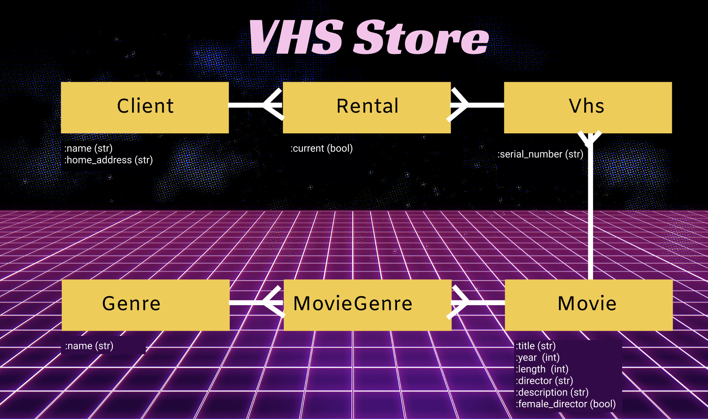

# ActiveRecord VHS Store


Welcome to your good old neighborhood VHS store. You will build an app that tracks the store inventory, the rentals and the clients. Prepare  for the 80s nostalgia.

---

## Associations

You will be working on a six-model domain: `Client`, `Rental`, `Vhs`, `Movie`, `MovieGenre`, `Genre`. The associations are as follows:
- Genre has many movie_genres and movies through movie_genres,
- MovieGenre belongs to a movie and a genre,
- Movie has many movie_genres and genres through movie_genres,
- Movie has many vhss and rentals through vhss,
- Vhs belongs to a movie,
- Vhs has many rentals and clients through rentals,
- Rental belongs to a client and vhs,
- Client has many rentals and vhss through rentals.

--- 

## ERD

**NOTE** that the below ERD does not include foreign keys -- these you need to add on your own, together with the accosiation macros. 

```
  Client 
    |
    ^
  Rental                  
    V
    |
    |
  Vhs >---- Movie ----< MovieGenre >---- Genre
```



--- 

## Getting Started

1. Carefully read the readme.
2. Fork and clone this lab.
3. Run `bundle`.
4. Check the code you have been given: see `app/models` and files in it (is there a class for every model? are all the associations set up?), see `db/schema`, see `rb/seeds.rb`. Run `rake db:migrate:status` to see if there are any pending migrations -- if there are, check these files and see if you need to add anything before migrating it.
5. Now that you know what is missing, DO NOT CODE JUST YET. Discuss with your partner the plan for the setup: what are you going to do step by step and how are you going to test if it worked. 
6. Run `rake -T` and see what process reminder tasks are available to you (they are marked with "🎁").
7. Start coding the setup. Test your code frequently.
8. After all your models are hooked up correctly, choose **minimum** five deliverables from the list below. You need to have at least one deliverable for each of the CRUD actions. The only compulsory deliverable is `Client.paid_most` (it's a read action). 
9. After you've chosen the deliverables, tackle one by one. Majority of them require helper methods, the use of `binding.pry`, and a good amount of pseudocoding. When writing helper methods, please remember that:
- each method should do JUST ONE JOB,
- each method name should be descriptive,
- it's alway best think about where the method should live; for instance: is it a behavior of a Client? or is it a behavior of a Vhs instance and should be called from within an instance method of a Client?

**NOTE**: all deliverables will make you a strong dev and will allow you for a good practice on ActiveRecord. Please spend some time on this lab, together with your partner or on your own. This lab can also be developed into a CLI that can serve as a strong portfolio piece or blog post material.

--- 

## Functionality

Build the following functionality:

### `Rental`
- `Rental#due_date` - returns a date one week from when the record was created
- `Rental.past_due_date` - returns a list of all the rentals past due date

### `Client`
- `Client.most_active` - returns a list of top 5 most active clients (i.e. those who had the most non-current / returned rentals)
- `Client#favorite_genres` - lists three genres that the client rented the most
- `Client.non_grata` - returns a list of all the clients who have a vhs past the due date (or, more difficult: who ever missed the return date)
- `Client#return_one` - accepts an argument of a movie instance, finds the corresponding rental and updates the rental's `current` attribute from `true` to `false`
- `Client#return_all`- updates `current` attribute from `true` to `false` on all client's rentals 
- `Client.paid_most` - returns an instance who has spent most money at the store; one rental is $5,35 upfront (bonus: additional $12 charge for every late return — do not count those that have not yet been returned) 
- `Client.total_watch_time` - returns an Integer of all movies watched by the all clients combined (assume that a rented movie is a watched movie)

### `Vhs`
- `Vhs.most_used` - prints a list of 3 vhss that have been most rented in the format: "serial number: 1111111 | title: 'movie title'
- `Vhs.all_genres` - returns a list of all genres available at the store
- `Vhs.available_now` - returns a list of all vhss currently available at the store
- `Vhs.hot_from_the_press` - accepts arguments used to create a new instance of a `Movie` and a name of a genre; creates the movie, associates it with appropriate genre and creates three instances of a `Vhs` associated with that Movie

### `Movie`
- `Movie.most_clients` - returns a list of TOP3 All Time favorites based on number of different clients who watched it 
- `Movie.most_rentals` - returns a list of TOP3 All Time favorites based on number of rentals
- `Movie.newest_first` - returns a list of all the movies from the most recent ones to the oldies but goldies based on the release year
- `Movie.longest` - returns a list of the movies from the longest to the shortest
- `Movie#recommendation` - prints a recommendation that includes a random emoji, the movie description, its length, director and year of release
- `Movie.surprise_me` - prints a recommendation for a random movie
- `Movie#report_stolen` - deletes a random vhs instance associated with this movie that's currently not rented out and prints information: "THANK YOU FOR YOUR REPORT. WE WILL LAUNCH AN INVESTIGATION."

### `Genre`
- `Genre.most_popular` - returns a list of 5 most popular genres based on number of movies
- `Genre.longest_movies` - returns a genre whose movies length average is the highest

### Non-model 
- `shop_fun_statistics` - should print out information about the store: how many VHSs there are in total, how many clients, how many movies available at this store (not all Movies in the database are available), how many genres, how much time clients watched the movies in total, what genre is the most popular among the clients, etc.


